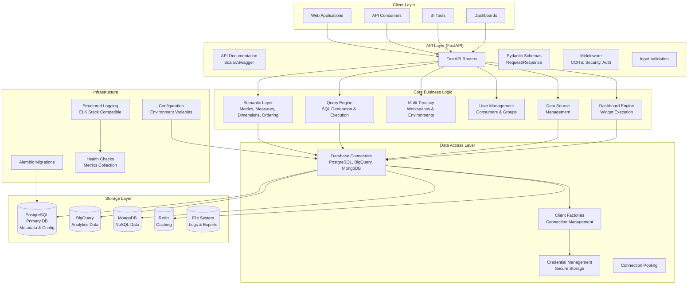
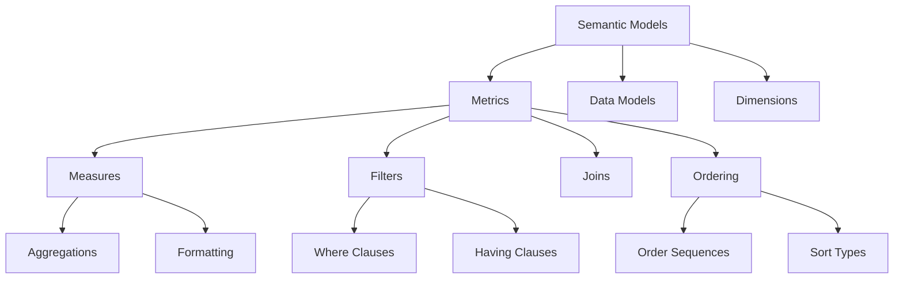
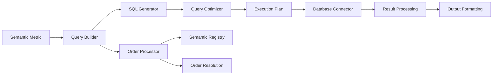
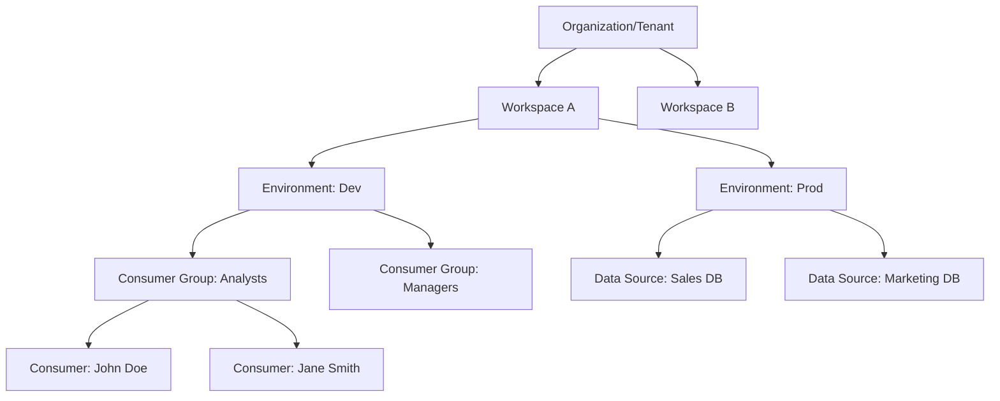
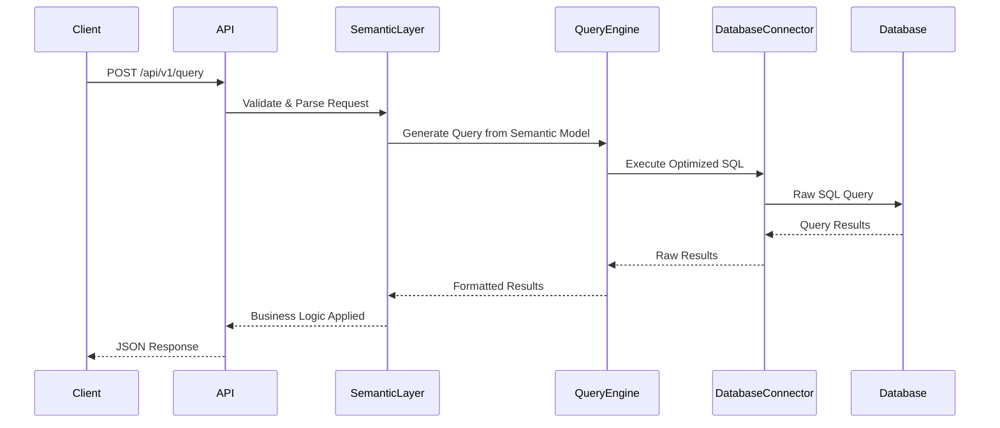
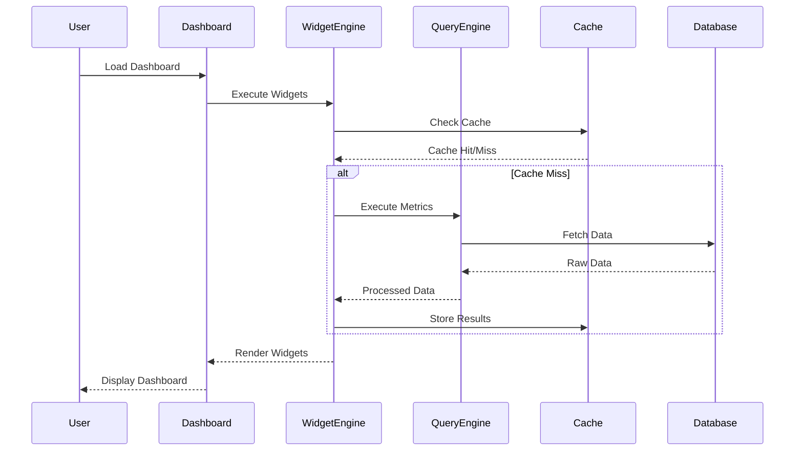

## System Architecture

Cortex is built on a **layered architecture** that ensures modularity, maintainability, and independent evolution of core components. The system follows modern software engineering practices with clear separation of concerns.



## Core Design Principles

### 1. Layered Architecture
The system is organized into distinct layers, each with specific responsibilities:

- **Client Layer**: User interfaces and API consumers
- **API Layer**: REST endpoints and request/response handling
- **Business Logic Layer**: Core domain logic and rules
- **Data Access Layer**: Database abstraction and connectivity
- **Storage Layer**: Physical data persistence

### 2. Separation of Concerns
Each component has a single, well-defined responsibility:

- **Semantic Layer**: Business logic abstraction
- **Query Engine**: SQL generation and optimization
- **Multi-Tenancy**: Organization and access control
- **Connectors**: Database-specific implementations

### 3. Factory Pattern for Extensibility
The database connector system uses the factory pattern to support multiple database types:

```python
# Example of connector factory usage
connector = DatabaseConnectorFactory.create(
    source_type="postgresql",
    config=connection_config
)
```

This allows easy addition of new database types without modifying existing code.

### 4. Type Safety First
Comprehensive use of Pydantic models throughout the system ensures:

- Runtime type validation
- Automatic API documentation generation
- IDE support and better developer experience
- Reduced runtime errors

## Component Architecture

### Semantic Layer

The semantic layer is the heart of Cortex, providing business-friendly abstractions over raw data:



**Key Components:**
- **Semantic Models**: JSON-based definitions of business concepts
- **Metrics**: Business calculations with measures and dimensions
- **Data Models**: Table and relationship definitions
- **Dimensions**: Grouping and filtering attributes
- **Measures**: Quantitative calculations (sum, count, average, etc.)
- **Ordering**: Result sorting with semantic order sequences

### Query Engine

The query engine translates semantic definitions into optimized database queries:



**Key Features:**
- **Multi-Database Support**: Unified interface across different databases
- **Query Optimization**: Database-specific optimizations
- **Real-time Formatting**: Data transformation during and after execution
- **Caching Integration**: Query result caching for performance
- **Semantic Ordering**: Context-aware result sorting with order sequences

### Multi-Tenant Architecture

Hierarchical organization supporting complex enterprise requirements:



**Hierarchy Levels:**
1. **Organization/Tenant**: Top-level isolation boundary
2. **Workspace**: Team or department-level grouping
3. **Environment**: Development, staging, production
4. **Consumer Groups**: Role-based access control
5. **Consumers**: Individual users
6. **Data Sources**: Database connections

## Data Flow Architecture

### Query Execution Flow



### Dashboard Execution Flow



## Database Architecture

### Primary Database (PostgreSQL)

The main metadata database stores:
- Organization and workspace configurations
- User and consumer group definitions
- Data source configurations
- Semantic model definitions
- Query execution logs
- Dashboard and widget configurations

**Schema Design:**
- Uses SQLAlchemy 2.0 with async support
- UUID primary keys for scalability
- Proper indexing on frequently queried fields
- Foreign key relationships for data integrity
- Alembic migrations for schema evolution

### External Data Sources

Cortex connects to multiple external databases:
- **PostgreSQL/MySQL**: Traditional relational databases
- **BigQuery**: Google Cloud data warehouse
- **MongoDB**: NoSQL document database
- **Snowflake**: Cloud data platform

**Connection Management:**
- Connection pooling for performance
- Credential encryption and secure storage
- Timeout and retry mechanisms
- Health monitoring and failover

## Security Architecture

### Authentication & Authorization
- **JWT-based authentication** (planned)
- **Role-based access control** (RBAC)
- **Workspace-level isolation**
- **Data source permissions**

### Data Security
- **Connection credential encryption**
- **Query parameter sanitization**
- **SQL injection prevention**
- **Audit logging**

### API Security
- **Input validation** with Pydantic
- **Rate limiting** (planned)
- **CORS configuration**
- **Security headers** with SecWeb

## Scalability Considerations

### Horizontal Scaling
- **Stateless API design** enables load balancing
- **Database connection pooling**
- **Query result caching** with Redis
- **Read replicas** for analytics databases

### Performance Optimizations
- **Query optimization** and indexing
- **Connection pooling** and reuse
- **Result caching** for frequently accessed data
- **Async operations** throughout the stack

### Resource Management
- **Memory management** for large result sets
- **Connection limits** and timeouts
- **Background job processing** for heavy operations
- **Resource monitoring** and alerting

## Deployment Architecture

### Development Environment
- Local development with hot reload
- Docker containers for services
- Development databases with sample data
- Comprehensive logging and debugging

### Production Environment
- Container orchestration (Kubernetes/Docker Compose)
- Load balancers and reverse proxies
- Production databases with backups
- Monitoring and alerting systems

### CI/CD Pipeline
- Automated testing and validation
- Container building and deployment
- Database migration management
- Rollback capabilities

## Monitoring & Observability

### System Monitoring
- **Health check endpoints**
- **Performance metrics** collection
- **Error tracking** and alerting
- **Resource utilization** monitoring

### Query Monitoring
- **Query execution times**
- **Query success/failure rates**
- **Data source performance**
- **Cache hit/miss ratios**

### Business Monitoring
- **User activity tracking**
- **Dashboard usage analytics**
- **Query pattern analysis**
- **System utilization trends**

## Future Extensibility

The architecture is designed for future enhancements:

- **AI Agent Integration**: Natural language query processing
- **Advanced Analytics**: Machine learning and predictive analytics
- **Real-time Streaming**: Event-driven data processing
- **API Gateway**: Enhanced security and rate limiting
- **Service Mesh**: Microservices communication
- **Edge Computing**: Distributed query execution

This architecture provides a solid foundation for building scalable, maintainable, and extensible analytics platforms while supporting the complex requirements of enterprise multi-tenant environments.
