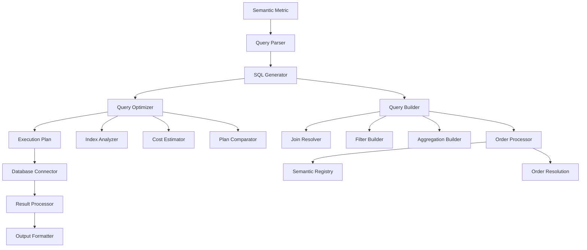
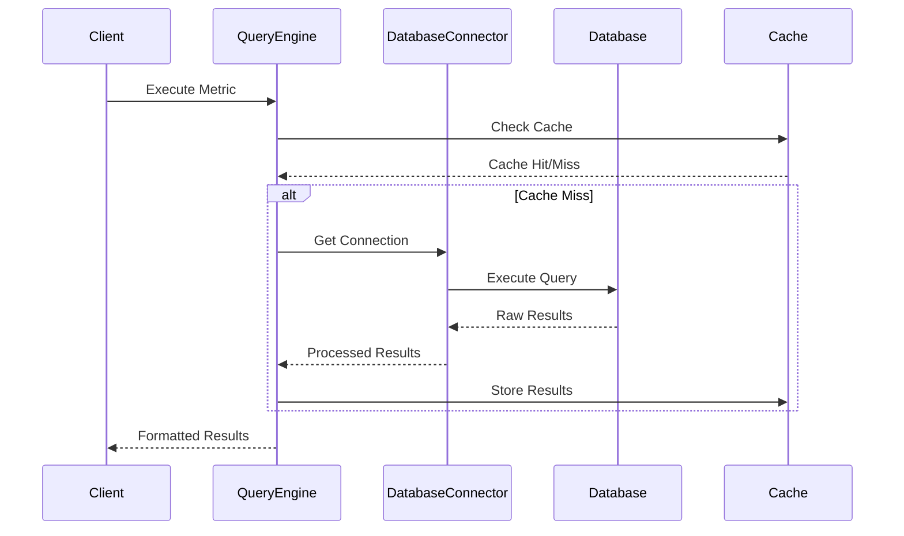

## Overview

The query engine is the core component responsible for translating semantic definitions into optimized database queries. It handles SQL generation, query optimization, execution across multiple database types, and result processing.

## Architecture



## Core Components

### Query Parser

The query parser analyzes semantic metric definitions and extracts:

- **Base tables** and their relationships
- **Measures** and aggregation functions
- **Dimensions** and grouping criteria
- **Filters** and conditions
- **Joins** and relationship mappings

```python
from cortex.core.query.parser import QueryParser

parser = QueryParser()
parsed_query = parser.parse_metric(semantic_metric)

# Extract query components
tables = parsed_query.get_base_tables()
joins = parsed_query.get_join_requirements()
filters = parsed_query.get_filter_conditions()
```

### SQL Generator

The SQL generator creates database-specific SQL statements:

```python
from cortex.core.query.generator import SQLGenerator

generator = SQLGenerator(database_type="postgresql")
sql_query = generator.generate(parsed_query)

print(sql_query)
# Output:
# SELECT
#   DATE_TRUNC('month', s.sale_date) as month,
#   SUM(s.amount) as revenue,
#   COUNT(*) as transaction_count
# FROM sales_transactions s
# LEFT JOIN customers c ON s.customer_id = c.customer_id
# WHERE s.sale_date >= '2024-01-01'
# GROUP BY DATE_TRUNC('month', s.sale_date)
# ORDER BY month
```

### Query Optimizer

The optimizer improves query performance through:

- **Index recommendations** for frequently queried columns
- **Join order optimization** for complex multi-table queries
- **Filter pushdown** to reduce data processing
- **Aggregation optimization** for large datasets

```python
from cortex.core.query.optimizer import QueryOptimizer

optimizer = QueryOptimizer()
optimized_query = optimizer.optimize(
    parsed_query=parsed_query,
    database_stats=database_statistics,
    query_history=historical_performance
```
)

# Apply optimizations
optimized_query = optimizer.apply_index_recommendations(optimized_query)
optimized_query = optimizer.optimize_join_order(optimized_query)
```

### Order Processor

The order processor handles semantic ordering by building a registry of available ordering targets and resolving order sequences to SQL ORDER BY clauses:

```python
from cortex.core.query.processors.order_processor import OrderProcessor

processor = OrderProcessor()
order_clause = processor.process_ordering(
    metric=semantic_metric,
    semantic_registry=registry
)

print(order_clause)
# Output: ORDER BY "Total Revenue" DESC, "Month" ASC NULLS FIRST
```

**Key Features:**
- **Semantic Registry**: Maps measure/dimension names to SQL expressions
- **Context-Aware Resolution**: Resolves ordering references to actual column names
- **Default Ordering**: Applies intelligent defaults when no ordering specified
- **Null Handling**: Supports NULLS FIRST/LAST positioning

```python
# Example: Building semantic registry
registry = {
    "total_revenue": "SUM(amount) AS \"Total Revenue\"",
    "month": "DATE_TRUNC('month', sale_date) AS \"Month\"",
    "customer_count": "COUNT(DISTINCT customer_id) AS \"Customer Count\""
}

# Process ordering sequences
order_sequences = [
    {
        "reference_type": "MEASURE",
        "reference": "total_revenue", 
        "order_type": "DESC",
        "nulls_position": "LAST"
    },
    {
        "reference_type": "DIMENSION",
        "reference": "month",
        "order_type": "ASC", 
        "nulls_position": "FIRST"
    }
]

order_clause = processor.build_order_clause(order_sequences, registry)
```

## Database Support

### PostgreSQL

Full-featured support with advanced PostgreSQL capabilities:

```sql
WITH monthly_sales AS (
  SELECT
    DATE_TRUNC('month', sale_date) as sale_month,
    customer_id,
    SUM(amount) as monthly_revenue,
    COUNT(*) as transaction_count
  FROM sales_transactions
  WHERE sale_date >= $1 AND sale_date <= $2
  GROUP BY DATE_TRUNC('month', sale_date), customer_id
),
customer_segments AS (
  SELECT
    customer_id,
    CASE
      WHEN lifetime_value > 10000 THEN 'High Value'
      WHEN lifetime_value > 1000 THEN 'Medium Value'
      ELSE 'Low Value'
    END as segment
  FROM customer_lifetime_values
)
SELECT
  ms.sale_month,
  cs.segment,
  SUM(ms.monthly_revenue) as segment_revenue,
  AVG(ms.transaction_count) as avg_transactions_per_customer
FROM monthly_sales ms
JOIN customer_segments cs ON ms.customer_id = cs.customer_id
GROUP BY ms.sale_month, cs.segment
ORDER BY ms.sale_month, cs.segment;
```

### BigQuery

Google BigQuery support with optimizations for cloud data warehouse:

```sql
WITH monthly_sales AS (
  SELECT
    DATE_TRUNC(sale_date, MONTH) as sale_month,
    customer_id,
    SUM(amount) as monthly_revenue,
    COUNT(*) as transaction_count
  FROM `project.dataset.sales_transactions`
  WHERE sale_date >= @start_date AND sale_date <= @end_date
  GROUP BY DATE_TRUNC(sale_date, MONTH), customer_id
)
SELECT
  sale_month,
  customer_segment,
  SUM(monthly_revenue) as segment_revenue,
  AVG(transaction_count) as avg_transactions
FROM monthly_sales
JOIN `project.dataset.customer_segments` USING (customer_id)
GROUP BY sale_month, customer_segment
ORDER BY sale_month, segment_revenue DESC;
```


## Query Execution

### Execution Flow



### Connection Management

The query engine manages database connections efficiently:

```python
from cortex.core.connectors.factory import DatabaseConnectorFactory

# Get a connector for the data source
connector = DatabaseConnectorFactory.create(
    source_type="postgresql",
    config=connection_config
)

# Execute with connection pooling
async with connector.get_connection() as conn:
    results = await connector.execute_query(
        sql_query=generated_sql,
        parameters=query_parameters
    )
```

### Error Handling and Retry Logic

```python
from cortex.core.query.executor import QueryExecutor
from tenacity import retry, stop_after_attempt, wait_exponential

class ResilientQueryExecutor(QueryExecutor):
    @retry(
        stop=stop_after_attempt(3),
        wait=wait_exponential(multiplier=1, min=4, max=10)
    )
    async def execute_with_retry(self, query):
        try:
            return await self.execute_query(query)
        except ConnectionError as e:
            logger.warning(f"Connection error, retrying: {e}")
            raise
        except TimeoutError as e:
            logger.error(f"Query timeout: {e}")
            raise
```

## Result Processing

### Output Formatting

The query engine supports two types of formatting:

#### IN_QUERY Formatting
Applied during SQL generation:

```python
# Example: Date truncation in SQL
dimension = {
    "name": "sale_month",
    "query": "DATE_TRUNC('month', sale_date)",
    "formatting": [
        {
            "name": "date_format",
            "type": "cast",
            "mode": "in_query",
            "target_type": "date"
        }
    ]
}
```

#### POST_QUERY Formatting
Applied to results after execution:

```python
# Example: Currency formatting
formatter = {
    "name": "currency_format",
    "type": "format",
    "mode": "post_query",
    "format_string": "${:,.2f}",
    "locale": "en_US"
}

# Apply formatting to results
for row in results:
    row['revenue'] = formatter.apply(row['revenue'])
```

### Built-in Formatters

| Formatter | Description | Example Input | Example Output |
|-----------|-------------|---------------|----------------|
| `currency` | Currency display | 1234.56 | $1,234.56 |
| `percentage` | Percentage display | 0.4567 | 45.67% |
| `decimal` | Decimal places | 123.456789 | 123.46 |
| `date` | Date formatting | 2024-01-15 | Jan 15, 2024 |
| `datetime` | Date/time formatting | 2024-01-15 14:30:00 | Jan 15, 2024 2:30 PM |
| `number` | Number formatting | 1234567 | 1,234,567 |
| `scientific` | Scientific notation | 0.000123 | 1.23e-4 |

## Caching and Performance

### Query Result Caching

```python
from cortex.core.cache.redis import RedisCache
from cortex.core.cache.key_generator import QueryKeyGenerator


class CachedQueryExecutor(QueryExecutor):
    def __init__(self, cache: RedisCache):
        self.cache = cache
        self.key_generator = QueryKeyGenerator()

    async def execute_cached(self, query, ttl=3600):
        cache_key = self.key_generator.generate_key(query)

        # Check cache first
        cached_result = await self.cache.get(cache_key)
        if cached_result:
            return cached_result

        # Execute query
        result = await self.execute_query(query)

        # Cache result
        await self.cache.set(cache_key, result, ttl=ttl)
        return result
```

### Cache Invalidation

```python
class SmartCacheInvalidator:
    def __init__(self, cache: RedisCache):
        self.cache = cache

    async def invalidate_on_data_change(self, table_name, changed_ids):
        # Invalidate related query results
        pattern = f"queries:*:{table_name}:*"
        keys = await self.cache.scan_keys(pattern)

        for key in keys:
            await self.cache.delete(key)

    async def invalidate_metric_cache(self, metric_name):
        # Invalidate specific metric results
        pattern = f"metrics:{metric_name}:*"
        keys = await self.cache.scan_keys(pattern)

        for key in keys:
            await self.cache.delete(key)
```

## Advanced Query Features

### Complex Joins

Handle multiple table relationships:

```python
# Multi-table join with complex conditions
join_definition = {
    "name": "customer_order_product",
    "type": "inner",
    "tables": [
        {
            "table": "orders",
            "alias": "o",
            "joins": [
                {
                    "table": "customers",
                    "alias": "c",
                    "condition": "o.customer_id = c.customer_id"
                },
                {
                    "table": "order_items",
                    "alias": "oi",
                    "condition": "o.order_id = oi.order_id"
                },
                {
                    "table": "products",
                    "alias": "p",
                    "condition": "oi.product_id = p.product_id"
                }
            ]
        }
    ]
}
```

### Window Functions

Support for advanced analytical functions:

```sql
SELECT
  customer_id,
  sale_date,
  amount,
  -- Running total
  SUM(amount) OVER (
    PARTITION BY customer_id
    ORDER BY sale_date
    ROWS BETWEEN UNBOUNDED PRECEDING AND CURRENT ROW
  ) as running_total,
  -- Rank by amount
  RANK() OVER (
    PARTITION BY DATE_TRUNC('month', sale_date)
    ORDER BY amount DESC
  ) as monthly_rank
FROM sales_transactions;
```

### Subqueries and CTEs

Complex query structures:

```sql
WITH monthly_customer_totals AS (
  SELECT
    customer_id,
    DATE_TRUNC('month', sale_date) as sale_month,
    SUM(amount) as monthly_total
  FROM sales_transactions
  WHERE sale_date >= '2024-01-01'
  GROUP BY customer_id, DATE_TRUNC('month', sale_date)
),
customer_segments AS (
  SELECT
    customer_id,
    CASE
      WHEN AVG(monthly_total) > 1000 THEN 'High Value'
      WHEN AVG(monthly_total) > 100 THEN 'Medium Value'
      ELSE 'Low Value'
    END as segment
  FROM monthly_customer_totals
  GROUP BY customer_id
)
SELECT
  cs.segment,
  mct.sale_month,
  SUM(mct.monthly_total) as segment_monthly_revenue
FROM monthly_customer_totals mct
JOIN customer_segments cs ON mct.customer_id = cs.customer_id
GROUP BY cs.segment, mct.sale_month
ORDER BY cs.segment, mct.sale_month;
```

## Monitoring and Debugging

### Query Performance Monitoring

```python
from cortex.core.monitoring.query_monitor import QueryMonitor

class MonitoredQueryExecutor(QueryExecutor):
    def __init__(self, monitor: QueryMonitor):
        self.monitor = monitor

    async def execute_with_monitoring(self, query):
        start_time = time.time()

        try:
            result = await self.execute_query(query)

            execution_time = time.time() - start_time
            await self.monitor.record_query_metrics(
                query=query,
                execution_time=execution_time,
                row_count=len(result),
                success=True
            )

            return result

        except Exception as e:
            execution_time = time.time() - start_time
            await self.monitor.record_query_metrics(
                query=query,
                execution_time=execution_time,
                error=str(e),
                success=False
            )
            raise
```

### Query Plan Analysis

```python
# Get query execution plan
query_plan = await connector.explain_query(generated_sql)

# Analyze plan for optimization opportunities
analyzer = QueryPlanAnalyzer()
recommendations = analyzer.analyze_plan(query_plan)

for recommendation in recommendations:
    print(f"Optimization: {recommendation.description}")
    print(f"Impact: {recommendation.impact}")
    print(f"Implementation: {recommendation.implementation}")
```

## Best Practices

### Query Optimization

1. **Use appropriate indexes** on frequently filtered columns
2. **Limit result sets** when possible
3. **Use efficient join types** (INNER vs LEFT vs RIGHT)
4. **Avoid SELECT *** in production queries
5. **Use query result caching** for expensive calculations

### Performance Monitoring

1. **Monitor query execution times** and set alerts
2. **Track query success/failure rates**
3. **Monitor database connection pools**
4. **Set up slow query logging**
5. **Regular performance audits**

### Error Handling

1. **Implement proper retry logic** for transient failures
2. **Log detailed error information** for debugging
3. **Graceful degradation** when services are unavailable
4. **User-friendly error messages** in API responses

### Security

1. **Use parameterized queries** to prevent SQL injection
2. **Validate all input parameters**
3. **Limit query complexity** to prevent resource exhaustion
4. **Implement query timeouts**
5. **Audit query patterns** for security monitoring

The query engine is designed to be highly extensible, supporting new database types and query features while maintaining optimal performance and reliability.
