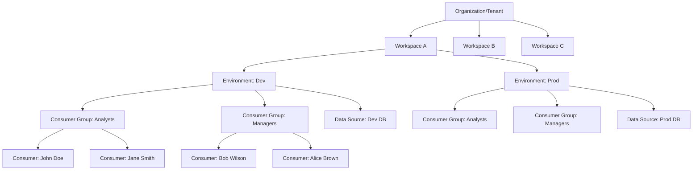

## Overview

Cortex implements a sophisticated multi-tenant architecture that supports complex organizational structures. The hierarchical model enables proper data isolation, access control, and resource management across multiple organizations, teams, and environments.

## Architecture Hierarchy



## Core Components

### Organizations

The top-level isolation boundary representing a complete tenant:

```python
from cortex.core.entities.organizations import Organization

class Organization:
    id: UUID
    name: str
    description: str
    created_at: datetime
    updated_at: datetime
    settings: dict
    is_active: bool

    # Metadata
    industry: str
    size: str
    region: str
```

**Responsibilities:**
- Top-level data isolation boundary
- Organization-wide settings and policies
- Billing and subscription management
- User access control across all workspaces

### Workspaces

Teams or departments within an organization:

```python
from cortex.core.entities.workspaces import Workspace

class Workspace:
    id: UUID
    organization_id: UUID
    name: str
    description: str
    created_at: datetime
    updated_at: datetime
    settings: dict
    is_active: bool

    # Workspace-specific configuration
    timezone: str
    currency: str
    language: str
```

**Responsibilities:**
- Team-level data and configuration isolation
- Workspace-specific settings and branding
- Independent data sources and semantic models
- Team-based access control

### Environments

Development, staging, and production environments:

```python
from cortex.core.entities.environments import Environment

class Environment:
    id: UUID
    workspace_id: UUID
    name: str
    type: EnvironmentType  # DEV, STAGING, PROD
    description: str
    created_at: datetime
    updated_at: datetime
    settings: dict
    is_active: bool

    # Environment configuration
    database_connections: dict
    api_endpoints: dict
    security_settings: dict
```

**Responsibilities:**
- Environment-specific data sources
- Configuration management
- Deployment isolation
- Environment-based access control

### Consumer Groups

Role-based access control groups:

```python
from cortex.core.entities.consumer_groups import ConsumerGroup

class ConsumerGroup:
    id: UUID
    environment_id: UUID
    name: str
    description: str
    permissions: list[str]
    created_at: datetime
    updated_at: datetime
    is_active: bool

    # Group configuration
    role_type: str  # ANALYST, MANAGER, ADMIN
    access_level: str  # READ, WRITE, ADMIN
```

**Responsibilities:**
- Role-based permission management
- Group-level access control
- Permission inheritance and overrides

### Consumers

Individual users with specific access rights:

```python
from cortex.core.entities.consumers import Consumer

class Consumer:
    id: UUID
    environment_id: UUID
    name: str
    email: str
    created_at: datetime
    updated_at: datetime
    is_active: bool

    # User properties
    properties: dict  # Custom user attributes
    preferences: dict  # UI and query preferences
    last_login: datetime
```

**Responsibilities:**
- Individual user identity and preferences
- Personal data access patterns
- User-specific query context

### Data Sources

Database connections scoped to environments:

```python
from cortex.core.entities.data_sources import DataSource

class DataSource:
    id: UUID
    environment_id: UUID
    name: str
    source_type: str  # postgresql, bigquery, mongodb
    config: dict  # Connection details
    created_at: datetime
    updated_at: datetime
    is_active: bool
```

    # Connection management
    connection_pool_size: int
    timeout_settings: dict
    retry_configuration: dict
```

**Responsibilities:**
- Environment-specific database connections
- Connection pooling and management
- Credential security and rotation

## Data Isolation

### Database-Level Isolation

```sql
-- Organizations table
CREATE TABLE organizations (
    id UUID PRIMARY KEY,
    name VARCHAR(255) NOT NULL,
    settings JSONB,
    created_at TIMESTAMP NOT NULL
);

-- Workspaces table with organization reference
CREATE TABLE workspaces (
    id UUID PRIMARY KEY,
    organization_id UUID REFERENCES organizations(id),
    name VARCHAR(255) NOT NULL,
    settings JSONB,
    created_at TIMESTAMP NOT NULL
);

-- Environments table with workspace reference
CREATE TABLE environments (
    id UUID PRIMARY KEY,
    workspace_id UUID REFERENCES workspaces(id),
    name VARCHAR(255) NOT NULL,
    type VARCHAR(50) NOT NULL,
    settings JSONB,
    created_at TIMESTAMP NOT NULL
);
```

### Query-Time Isolation

```python
# Context-aware query execution
class MultiTenantQueryExecutor:
    def __init__(self, tenant_context: TenantContext):
        self.tenant_context = tenant_context

    async def execute_metric(self, metric, parameters=None):
        # Apply tenant isolation filters
        tenant_filters = self.build_tenant_filters()

        # Add to existing metric filters
        enhanced_metric = self.apply_tenant_filters(metric, tenant_filters)

        # Execute with tenant context
        return await self.query_engine.execute_metric(
            metric=enhanced_metric,
            parameters=parameters,
            context=self.tenant_context
        )

    def build_tenant_filters(self):
        """Build filters based on tenant hierarchy"""
        filters = []

        if self.tenant_context.organization_id:
            filters.append({
                "column": "organization_id",
                "operator": "=",
                "value": self.tenant_context.organization_id
            })

        if self.tenant_context.workspace_id:
```
            filters.append({
                "column": "workspace_id",
                "operator": "=",
                "value": self.tenant_context.workspace_id
            })

        return filters
```

## Access Control

### Permission System

```python
from enum import Enum

class Permission(Enum):
    # Data access permissions
    READ_DATA = "read_data"
    WRITE_DATA = "write_data"
    DELETE_DATA = "delete_data"

    # Metric permissions
    CREATE_METRIC = "create_metric"
    EDIT_METRIC = "edit_metric"
    DELETE_METRIC = "delete_metric"
    EXECUTE_METRIC = "execute_metric"

    # Dashboard permissions
    CREATE_DASHBOARD = "create_dashboard"
    EDIT_DASHBOARD = "edit_dashboard"
    SHARE_DASHBOARD = "share_dashboard"
    DELETE_DASHBOARD = "delete_dashboard"

    # Administrative permissions
    MANAGE_USERS = "manage_users"
    MANAGE_DATA_SOURCES = "manage_data_sources"
    MANAGE_WORKSPACES = "manage_workspaces"
    SYSTEM_ADMIN = "system_admin"

class Role:
    def __init__(self, name: str, permissions: list[Permission]):
        self.name = name
        self.permissions = permissions

# Predefined roles
ANALYST_ROLE = Role("Analyst", [
    Permission.READ_DATA,
    Permission.EXECUTE_METRIC,
    Permission.CREATE_DASHBOARD,
    Permission.EDIT_DASHBOARD
])

MANAGER_ROLE = Role("Manager", [
    Permission.READ_DATA,
    Permission.EXECUTE_METRIC,
    Permission.CREATE_METRIC,
    Permission.EDIT_METRIC,
    Permission.CREATE_DASHBOARD,
    Permission.EDIT_DASHBOARD,
    Permission.SHARE_DASHBOARD
])

ADMIN_ROLE = Role("Admin", [
    Permission.READ_DATA,
    Permission.WRITE_DATA,
    Permission.DELETE_DATA,
    Permission.CREATE_METRIC,
    Permission.EDIT_METRIC,
    Permission.DELETE_METRIC,
    Permission.EXECUTE_METRIC,
    Permission.CREATE_DASHBOARD,
    Permission.EDIT_DASHBOARD,
    Permission.SHARE_DASHBOARD,
    Permission.DELETE_DASHBOARD,
    Permission.MANAGE_USERS,
    Permission.MANAGE_DATA_SOURCES
])
```

### Permission Checking

```python
class PermissionChecker:
    def __init__(self, user_permissions: list[Permission]):
        self.user_permissions = user_permissions

    def has_permission(self, required_permission: Permission) -> bool:
        return required_permission in self.user_permissions

    def has_any_permission(self, permissions: list[Permission]) -> bool:
        return any(perm in self.user_permissions for perm in permissions)

    def check_metric_access(self, metric, action: str) -> bool:
        """Check if user can perform action on metric"""
        permission_map = {
            "read": Permission.READ_DATA,
            "execute": Permission.EXECUTE_METRIC,
            "create": Permission.CREATE_METRIC,
            "edit": Permission.EDIT_METRIC,
            "delete": Permission.DELETE_METRIC
        }

        required_perm = permission_map.get(action)
        if not required_perm:
            return False

        return self.has_permission(required_perm)

    def check_dashboard_access(self, dashboard, action: str) -> bool:
        """Check if user can perform action on dashboard"""
        permission_map = {
            "view": Permission.READ_DATA,
            "create": Permission.CREATE_DASHBOARD,
            "edit": Permission.EDIT_DASHBOARD,
            "share": Permission.SHARE_DASHBOARD,
            "delete": Permission.DELETE_DASHBOARD
        }

        required_perm = permission_map.get(action)
        if not required_perm:
            return False

        return self.has_permission(required_perm)
```

## Context Propagation

### Tenant Context

```python
from typing import Optional
from uuid import UUID

@dataclass
class TenantContext:
    """Context object for tenant-aware operations"""
    organization_id: Optional[UUID] = None
    workspace_id: Optional[UUID] = None
    environment_id: Optional[UUID] = None
    consumer_id: Optional[UUID] = None
    consumer_groups: list[UUID] = None

    # Additional context
    user_properties: dict = None
    session_properties: dict = None

    def get_tenant_path(self) -> str:
        """Get hierarchical path for tenant identification"""
        path_parts = []

        if self.organization_id:
            path_parts.append(f"org_{self.organization_id}")

        if self.workspace_id:
            path_parts.append(f"ws_{self.workspace_id}")

        if self.environment_id:
            path_parts.append(f"env_{self.environment_id}")

        return "/".join(path_parts)

    def get_cache_key_prefix(self) -> str:
        """Generate cache key prefix for tenant isolation"""
        return f"tenant:{self.get_tenant_path()}"

    def get_audit_context(self) -> dict:
        """Generate audit context for logging"""
        return {
            "organization_id": str(self.organization_id) if self.organization_id else None,
            "workspace_id": str(self.workspace_id) if self.workspace_id else None,
            "environment_id": str(self.environment_id) if self.environment_id else None,
            "consumer_id": str(self.consumer_id) if self.consumer_id else None,
            "timestamp": datetime.utcnow().isoformat()
        }
```

### Context-Aware Services

```python
class TenantAwareService:
    """Base service class with tenant context"""

    def __init__(self, tenant_context: TenantContext):
        self.tenant_context = tenant_context

    async def get_organization(self) -> Organization:
        """Get organization with tenant context"""
        if not self.tenant_context.organization_id:
            raise ValueError("Organization ID required")

        return await self.organization_repository.get_by_id(
            self.tenant_context.organization_id
        )

    async def get_workspace(self) -> Workspace:
        """Get workspace with tenant context"""
        if not self.tenant_context.workspace_id:
            raise ValueError("Workspace ID required")

        return await self.workspace_repository.get_by_id(
            self.tenant_context.workspace_id
        )

    async def list_environments(self) -> list[Environment]:
        """List environments for current workspace"""
        if not self.tenant_context.workspace_id:
            raise ValueError("Workspace ID required")

        return await self.environment_repository.get_by_workspace(
            self.tenant_context.workspace_id
        )

    async def validate_tenant_access(self, resource_tenant_id: UUID) -> bool:
        """Validate if current tenant has access to resource"""
        tenant_path = self.tenant_context.get_tenant_path()
        resource_path = f"org_{resource_tenant_id}"

        # Check if resource belongs to current organization
        return tenant_path.startswith(resource_path)
```

## Data Source Management

### Environment-Specific Connections

```python
class DataSourceManager:
    """Manages data source connections for environments"""

    def __init__(self, tenant_context: TenantContext):
        self.tenant_context = tenant_context
        self.connection_pools = {}

    async def get_data_source(self, data_source_id: UUID) -> DataSource:
        """Get data source for current environment"""
        data_source = await self.data_source_repository.get_by_id(
            data_source_id
        )

        # Validate environment access
        if data_source.environment_id != self.tenant_context.environment_id:
            raise PermissionError("Access denied to data source")

        return data_source

    async def get_connection(self, data_source_id: UUID):
        """Get database connection for data source"""
        data_source = await self.get_data_source(data_source_id)

        # Create connection pool if not exists
        if data_source_id not in self.connection_pools:
            self.connection_pools[data_source_id] = await self.create_connection_pool(
                data_source
            )

        return await self.connection_pools[data_source_id].get_connection()

    async def create_connection_pool(self, data_source: DataSource):
        """Create connection pool for data source"""
        connector = DatabaseConnectorFactory.create(
            source_type=data_source.source_type,
            config=data_source.config
        )

        return await connector.create_pool(
            pool_size=data_source.connection_pool_size,
            timeout=data_source.timeout_settings
        )
```

## Audit and Compliance

### Audit Logging

```python
class AuditLogger:
    """Logs all tenant-aware operations for compliance"""

    def __init__(self, tenant_context: TenantContext):
        self.tenant_context = tenant_context

    async def log_operation(self, operation: str, resource: str, details: dict):
        """Log an operation with full tenant context"""
        audit_entry = {
            "timestamp": datetime.utcnow().isoformat(),
            "operation": operation,
            "resource": resource,
            "details": details,
            "tenant_context": self.tenant_context.get_audit_context(),
            "user_agent": self.get_user_agent(),
            "ip_address": self.get_client_ip()
        }

        await self.audit_repository.save(audit_entry)

        # Check for security monitoring
        await self.security_monitor.check_operation(audit_entry)

    async def log_metric_execution(self, metric_name: str, parameters: dict, result_count: int):
        """Log metric execution for analytics"""
        await self.log_operation(
            operation="execute_metric",
            resource=f"metric:{metric_name}",
            details={
                "parameters": parameters,
                "result_count": result_count,
                "duration": self.get_execution_time()
            }
        )

    async def log_data_access(self, data_source_id: UUID, query: str, row_count: int):
        """Log data access operations"""
        await self.log_operation(
            operation="access_data",
            resource=f"datasource:{data_source_id}",
            details={
                "query_hash": self.hash_query(query),
                "row_count": row_count
            }
        )
```

## Best Practices

### 1. Tenant Isolation
- Always validate tenant context in operations
- Use tenant-specific database schemas when possible
- Implement proper data access controls
- Log all cross-tenant operations

### 2. Performance Considerations
- Cache tenant-specific configurations
- Use connection pooling per tenant
- Implement query result caching with tenant isolation
- Monitor resource usage per tenant

### 3. Security Best Practices
- Encrypt sensitive tenant data
- Implement proper authentication and authorization
- Use HTTPS for all tenant communications
- Regular security audits and penetration testing

### 4. Scalability
- Design for horizontal scaling of tenant workloads
- Implement proper load balancing
- Use CDN for static assets
- Monitor and alert on tenant-specific metrics

### 5. Compliance
- Implement audit logging for all operations
- Maintain data retention policies per tenant
- Support data export and deletion requests
- Regular compliance audits

## Use Cases

### SaaS Analytics Platform
Perfect for building analytics platforms serving multiple customers:

- **Customer Isolation**: Complete data separation between tenants
- **Custom Branding**: White-label dashboards per customer
- **Scalable Architecture**: Handle multiple tenants efficiently
- **Billing Integration**: Usage tracking and billing per tenant

### Enterprise Analytics
Large organizations with multiple departments:

- **Department Isolation**: Separate analytics per team
- **Environment Management**: Dev, staging, production environments
- **Role-Based Access**: Different permissions for analysts vs managers
- **Governance**: Centralized control with distributed access

### Multi-Product Analytics
Companies with multiple products or services:

- **Product Isolation**: Separate analytics per product
- **Cross-Product Insights**: Unified view across products
- **Team Collaboration**: Shared insights across product teams
- **Performance Monitoring**: Compare performance across products

This multi-tenant architecture provides the foundation for scalable, secure, and manageable analytics platforms that can serve diverse organizational needs while maintaining proper isolation and access controls.
