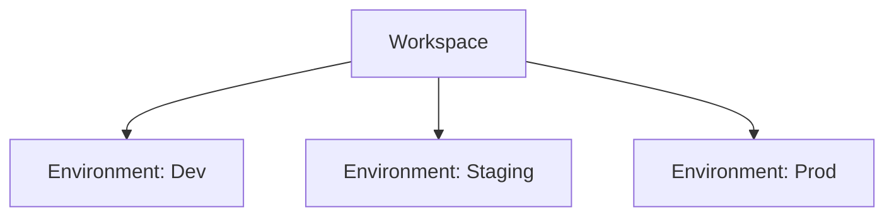

## Overview

Cortex models multi-tenancy with two building blocks:

- Workspace: The top-level container for a tenant/project.
- Environment: A scoped context within a workspace (for example, Development, Staging, Production).

Every module in Cortex (Data Sources, Data Models, Consumers, Consumer Groups, Metrics, Dashboards) is associated with a specific Environment, and therefore implicitly belongs to exactly one Workspace via that Environment.

## Architecture



## Core Components

### Workspaces

Top-level tenant/project container.


```python [cortex/core/workspaces/workspace.py]
class Workspace(TSModel):
    model_config = ConfigDict(from_attributes=True)
    id: UUID = -1
    name: str
    description: Optional[str]
    created_at: datetime = datetime.now(pytz.UTC)
    updated_at: datetime = datetime.now(pytz.UTC)
```

### Environments

A scoped context under a Workspace (e.g., Development, Staging, Production). All other modules are attached to an Environment.

```python [cortex/core/workspaces/environments/environment.py]
class WorkspaceEnvironment(TSModel):
    model_config = ConfigDict(from_attributes=True)
    
    id: UUID = -1
    workspace_id: UUID
    name: str = "Development"
    description: Optional[str] = "Default environment for the workspace environment"
    created_at: datetime = datetime.now(pytz.UTC)
    updated_at: datetime = datetime.now(pytz.UTC)
```

## Scoping rules

- A Workspace contains many Environments.
- Each Environment belongs to exactly one Workspace (via `workspace_id`).
- All other modules (Data Sources, Data Models, Consumers, Consumer Groups, Metrics, Dashboards) are associated with an Environment and inherit Workspace context through it.

## Typical lifecycle

1. Create a Workspace (name and optional description).
2. Create one or more Environments under that Workspace.
3. Attach environment-scoped resources (data sources, models, metrics, dashboards) to the appropriate Environment.
