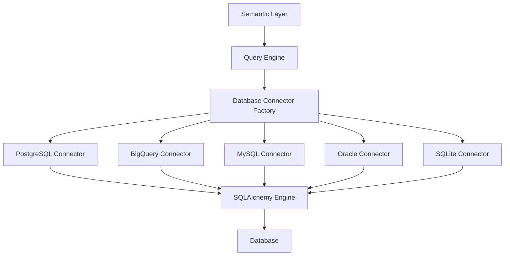

## Overview

Cortex uses a factory pattern for database connectors, enabling seamless integration with multiple database types while maintaining a consistent interface. This extensible architecture allows easy addition of new database connectors without modifying existing code.

## Architecture



## Supported Databases

### PostgreSQL (Primary)

Full-featured support with advanced PostgreSQL capabilities:

**Configuration:**
```json
{
  "name": "production_db",
  "source_type": "postgresql",
  "config": {
    "host": "prod-postgres.company.com",
    "port": 5432,
    "database": "analytics_db",
    "username": "cortex_user",
    "password": "secure_password",
    "dialect": "postgresql"
  }
}
```

**Features:**
- Full SQL generation and optimization
- SQLAlchemy integration
- Schema discovery and introspection
- Table and column information retrieval
- Query execution with parameter support

### Google BigQuery

Cloud-native data warehouse support with Google Cloud integration:

**Configuration:**
```json
{
  "name": "bigquery_analytics",
  "source_type": "bigquery",
  "config": {
    "project_id": "my-project-id",
    "dataset_id": "analytics_dataset",
    "service_account_details": "base64_encoded_credentials"
  }
}
```

**Features:**
- Native BigQuery SQL dialect
- Service account authentication
- Dataset and table exploration
- SQL query execution
- Schema introspection

### MySQL

Relational database support with MySQL-specific optimizations:

**Configuration:**
```json
{
  "name": "mysql_analytics",
  "source_type": "mysql",
  "config": {
    "host": "mysql.company.com",
    "port": 3306,
    "database": "analytics_db",
    "username": "cortex_user",
    "password": "secure_password",
    "dialect": "mysql"
  }
}
```

**Features:**
- MySQL-specific SQL generation
- Connection string optimization
- Schema discovery
- Query execution

### Oracle

Enterprise database support:

**Configuration:**
```json
{
  "name": "oracle_analytics",
  "source_type": "oracle",
  "config": {
    "host": "oracle.company.com",
    "port": 1521,
    "database": "analytics_db",
    "username": "cortex_user",
    "password": "secure_password",
    "dialect": "oracle"
  }
}
```

**Features:**
- Oracle-specific SQL generation
- Schema introspection
- Query execution

### SQLite

Lightweight database support for development and testing:

**Configuration:**
```json
{
  "name": "sqlite_analytics",
  "source_type": "sqlite",
  "config": {
    "database": "/path/to/analytics.db",
    "dialect": "sqlite"
  }
}
```

**Features:**
- File-based database support
- Schema discovery
- Query execution
- Ideal for development and testing

## Database Client Usage

### Basic Usage

```python
from cortex.core.connectors.databases.clients.service import DBClientService
from cortex.core.types.databases import DataSourceTypes

# Create PostgreSQL client
postgres_config = {
    "host": "localhost",
    "port": 5432,
    "username": "cortex_user",
    "password": "password",
    "database": "analytics_db",
    "dialect": "postgresql"
}

postgres_client = DBClientService.get_client(
    details=postgres_config,
    db_type=DataSourceTypes.POSTGRESQL
)

# Connect and execute query
postgres_client.connect()
results = postgres_client.query("SELECT * FROM sales LIMIT 10")
```

### BigQuery Usage

```python
# Create BigQuery client
bigquery_config = {
    "project_id": "my-project-id",
    "dataset_id": "analytics_dataset",
    "service_account_details": "base64_encoded_credentials"
}

bigquery_client = DBClientService.get_client(
    details=bigquery_config,
    db_type=DataSourceTypes.BIGQUERY
)

# Connect and execute query
bigquery_client.connect()
results = bigquery_client.query("SELECT * FROM `project.dataset.table` LIMIT 10")
```

## Query Execution

### PostgreSQL Query Execution

```sql
-- Example of complex query with joins and aggregations
WITH monthly_revenue AS (
  SELECT
    DATE_TRUNC('month', o.order_date) as sale_month,
    c.customer_segment,
    p.product_category,
    SUM(o.total_amount) as revenue,
    COUNT(DISTINCT o.order_id) as order_count,
    COUNT(DISTINCT c.customer_id) as unique_customers
  FROM orders o
  JOIN customers c ON o.customer_id = c.customer_id
  JOIN products p ON o.product_id = p.product_id
  WHERE o.order_date >= $1 AND o.order_date <= $2
  GROUP BY DATE_TRUNC('month', o.order_date), c.customer_segment, p.product_category
),
segment_totals AS (
  SELECT
    sale_month,
    customer_segment,
    SUM(revenue) as segment_revenue,
    SUM(order_count) as segment_orders
  FROM monthly_revenue
  GROUP BY sale_month, customer_segment
)
SELECT
  mr.sale_month,
  mr.customer_segment,
  mr.product_category,
  mr.revenue,
  mr.order_count,
  mr.unique_customers,
  ROUND(mr.revenue / st.segment_revenue * 100, 2) as revenue_percentage
FROM monthly_revenue mr
JOIN segment_totals st ON mr.sale_month = st.sale_month
  AND mr.customer_segment = st.customer_segment
ORDER BY mr.sale_month, mr.customer_segment, mr.revenue DESC;
```

### BigQuery Query Execution

```sql
-- Example BigQuery query with partitioning
WITH monthly_revenue AS (
  SELECT
    DATE_TRUNC(order_date, MONTH) as sale_month,
    customer_segment,
    product_category,
    SUM(total_amount) as revenue,
    COUNT(DISTINCT order_id) as order_count,
    COUNT(DISTINCT customer_id) as unique_customers
  FROM `project.analytics.orders` o
  JOIN `project.analytics.customers` c ON o.customer_id = c.customer_id
  JOIN `project.analytics.products` p ON o.product_id = p.product_id
  WHERE order_date >= @start_date AND order_date <= @end_date
  GROUP BY DATE_TRUNC(order_date, MONTH), customer_segment, product_category
),
segment_totals AS (
  SELECT
    sale_month,
    customer_segment,
    SUM(revenue) as segment_revenue,
    SUM(order_count) as segment_orders
  FROM monthly_revenue
  GROUP BY sale_month, customer_segment
)
SELECT
  sale_month,
  customer_segment,
  product_category,
  revenue,
  order_count,
  unique_customers,
  ROUND(revenue / segment_revenue * 100, 2) as revenue_percentage
FROM monthly_revenue
JOIN segment_totals USING (sale_month, customer_segment)
ORDER BY sale_month, customer_segment, revenue DESC;
```

## Connector Development

### Creating Custom Connectors

```python
from cortex.core.connectors.databases.clients.base import DatabaseClient
from cortex.core.connectors.databases.clients.factory.abstracts import DatabaseClientFactory

class CustomDatabaseClient(DatabaseClient):
    """Custom database client implementation"""

    def __init__(self, credentials):
        super().__init__(credentials=credentials)
        self.engine = None

    def connect(self):
        """Establish connection to custom database"""
        # Implement connection logic
        conn_string = self.get_uri()
        self.engine = create_engine(conn_string)
        self.client = self.engine.connect()
        return self

    def get_uri(self) -> str:
        """Get connection string"""
        # Implement URI generation
        return f"custom://{self.credentials.host}:{self.credentials.port}/{self.credentials.database}"

    def query(self, sql, params=None):
        """Execute query with custom database syntax"""
        if self.client is None:
            self.connect()
        
        # Implement query execution
        result = self.client.execute(text(sql), params or {})
        return result.fetchall()

    def get_schema(self):
        """Get schema information"""
        # Implement schema discovery
        return {"tables": [], "columns": []}

    def get_table_names(self, **kwargs):
        """Get table names"""
        return []
```

### Connector Interface

```python
from abc import abstractmethod
from typing import Any, Optional
from cortex.core.types.telescope import TSModel

class DatabaseClient(TSModel):
    """Abstract base class for database clients"""
    credentials: TSModel
    client: Optional[Any] = None

    @abstractmethod
    def connect(self):
        """Establish database connection"""
        pass

    @abstractmethod
    def get_uri(self) -> str:
        """Get connection string"""
        pass

    @abstractmethod
    def query(self, **kwargs):
        """Execute query"""
        pass

    @abstractmethod
    def get_schema(self):
        """Get schema information"""
        pass

    @abstractmethod
    def get_table_names(self, **kwargs):
        """Get table names"""
        pass
```

## Performance Considerations

### Query Optimization

The current implementation provides basic query execution capabilities. For production use, consider:

- **Index Optimization**: Ensure proper database indexes for frequently queried columns
- **Query Analysis**: Use database-specific tools like `EXPLAIN` for PostgreSQL
- **Result Limiting**: Always use `LIMIT` clauses for large result sets
- **Connection Management**: Implement connection pooling for high-traffic scenarios

### Best Practices

```python
# Example of optimized query execution
def execute_optimized_query(client, query, limit=1000):
    """Execute query with performance optimizations"""
    # Add limit if not present
    if 'LIMIT' not in query.upper():
        query += f" LIMIT {limit}"
    
    # Execute query
    client.connect()
    try:
        results = client.query(query)
        return results
    finally:
        # Close connection to free resources
        if client.client:
            client.client.close()
```

## Basic Health Checks

### Connection Testing

```python
def test_connection(client):
    """Basic connection health check"""
    try:
        client.connect()
        # Test with simple query
        result = client.query("SELECT 1 as test")
        return len(result) > 0
    except Exception as e:
        print(f"Connection failed: {e}")
        return False
    finally:
        # Clean up connection
        if client.client:
            client.client.close()
```

## Security Considerations

### Credential Management

Currently, credentials are stored in plain text in configuration. For production use, consider:

- **Environment Variables**: Store sensitive data in environment variables
- **Secret Management**: Use services like AWS Secrets Manager or HashiCorp Vault
- **Credential Rotation**: Implement regular credential updates
- **Access Logging**: Log all database access attempts

### Basic Security Example

```python
import os
from cortex.core.connectors.databases.clients.service import DBClientService
from cortex.core.types.databases import DataSourceTypes

def create_secure_client():
    """Create client with credentials from environment"""
    config = {
        "host": os.getenv("DB_HOST"),
        "port": int(os.getenv("DB_PORT", "5432")),
        "username": os.getenv("DB_USERNAME"),
        "password": os.getenv("DB_PASSWORD"),
        "database": os.getenv("DB_NAME"),
        "dialect": "postgresql"
    }
    
    return DBClientService.get_client(
        details=config,
        db_type=DataSourceTypes.POSTGRESQL
    )
```

## Troubleshooting

### Common Connection Issues

1. **Authentication Failures**
   ```python
   # Verify credentials
   def test_credentials(host, username, password, database):
       try:
           config = {
               "host": host,
               "port": 5432,
               "username": username,
               "password": password,
               "database": database,
               "dialect": "postgresql"
           }
           
           from cortex.core.connectors.databases.clients.service import DBClientService
           from cortex.core.types.databases import DataSourceTypes
           
           client = DBClientService.get_client(
               details=config,
               db_type=DataSourceTypes.POSTGRESQL
           )
           client.connect()
           return True
       except Exception as e:
           print(f"Authentication failed: {e}")
           return False
   ```

2. **Connection Errors**
   ```python
   # Test basic connectivity
   def test_connectivity(host, port):
       import socket
       try:
           sock = socket.socket(socket.AF_INET, socket.SOCK_STREAM)
           sock.settimeout(5)
           result = sock.connect_ex((host, port))
           sock.close()
           return result == 0
       except Exception:
           return False
   ```

3. **Query Execution Issues**
   ```python
   # Test query execution
   def test_query(client, query):
       try:
           client.connect()
           result = client.query(query)
           return len(result) > 0
       except Exception as e:
           print(f"Query failed: {e}")
           return False
       finally:
           if client.client:
               client.client.close()
   ```

## Best Practices

### 1. Connection Management
- Always close connections after use
- Use try-finally blocks for connection cleanup
- Test connections before executing queries
- Handle connection errors gracefully

### 2. Security
- Store credentials in environment variables
- Use parameterized queries when possible
- Validate all user inputs
- Log access attempts

### 3. Performance
- Limit result sets with appropriate queries
- Use database indexes effectively
- Monitor query execution times
- Implement proper error handling

### 4. Development
- Follow the established client interface
- Write comprehensive tests
- Document custom implementations
- Handle exceptions properly

The connector system provides a solid foundation for database integration while maintaining simplicity and extensibility for future enhancements.
